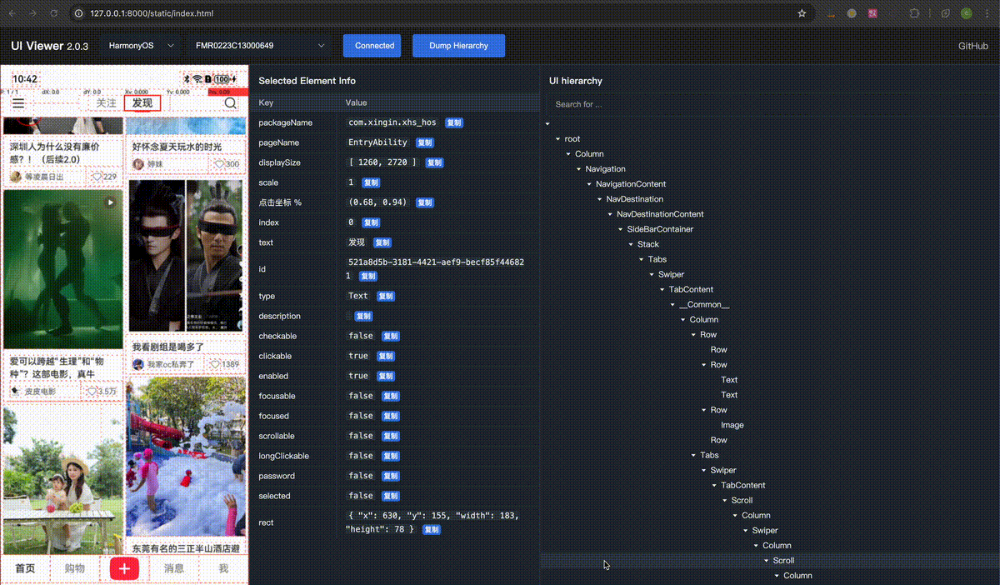
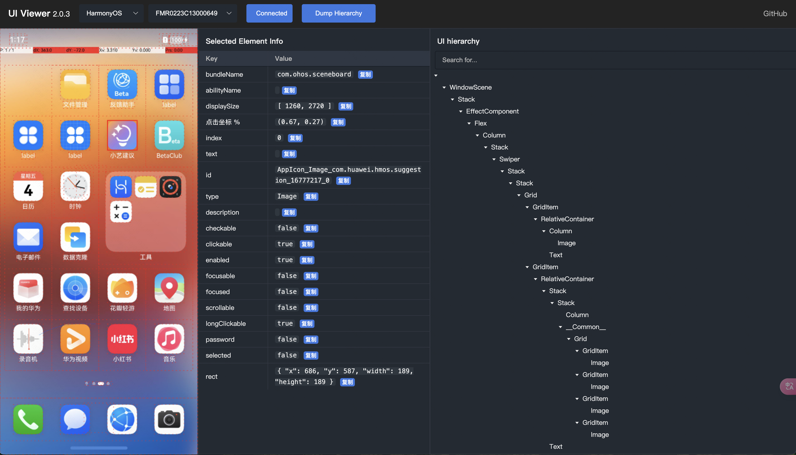
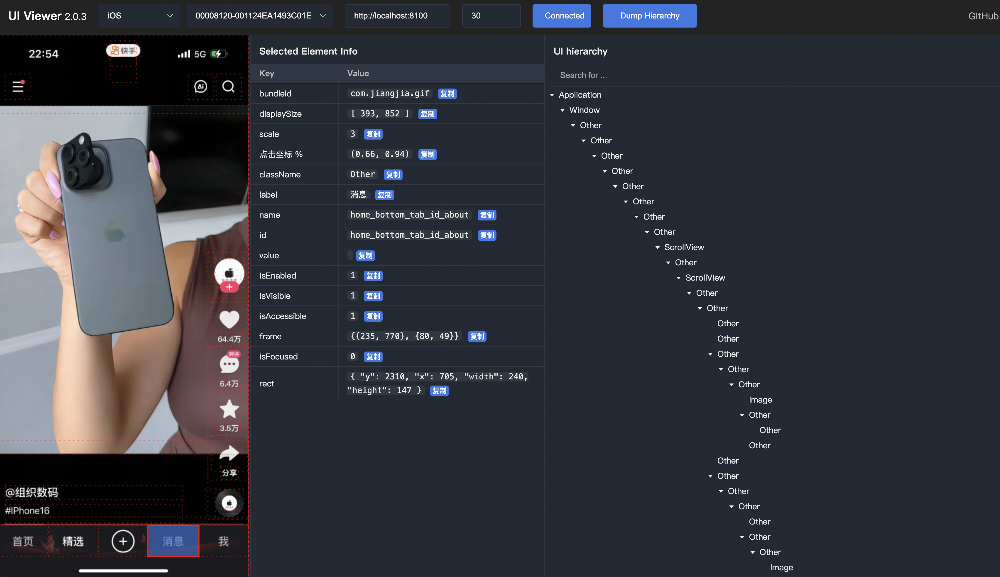

# ui-viewer
UI hierarchy visualization tool, supporting Android, iOS, HarmonyOS NEXT.



# Installation
```shell
pip3 install -U uiviewer
```

# Run
Start with a default port (8000)
```shell
uiviewer
# or
python3 -m uiviewer
```
Start with a custom port
```
uiviewer -p <PORT>
python3 -m uiviewer -p <PORT>

```
and then open the browser to [http://localhost:8000](http://localhost:8000)


# Tips
- If you are using a virtual environment, please make sure to activate it before running the command.
- On iOS, please ensure that WDA is successfully started and wda port forwarding is successful in advance.
  -   First, Use `xcode` or  `tidevice` or `go-ios` to launch wda.
  ```
  tidevice xctest -B <wda_bundle_id>
  ```
  - Second, Use `tidevice` or `iproxy` to forward the wda port，and keep it running.
  ```
  tidevice relay <local_port> 8100
  ```
  - Finally, To ensure the success of the browser to access `http://localhost:<local_port>/status`
- On iOS，WDA can easily freeze when dumping high UI hierarchy. You can reduce the **`maxDepth`** on the web page. The default is 30.

# preview
- HarmonyOS
  

- Android


- iOS

